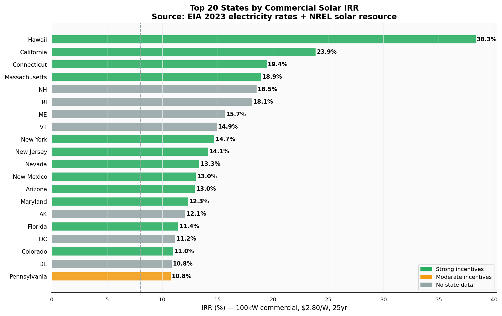
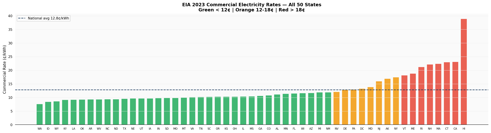
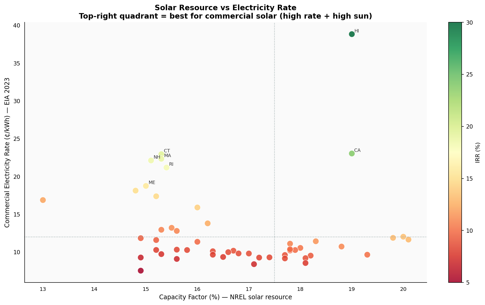
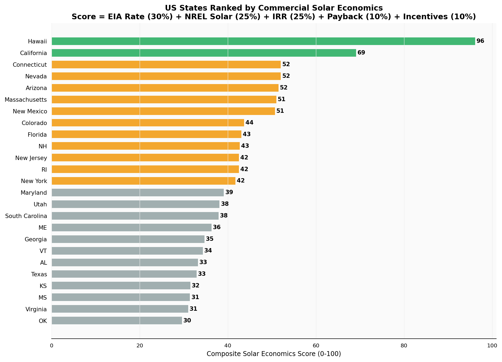
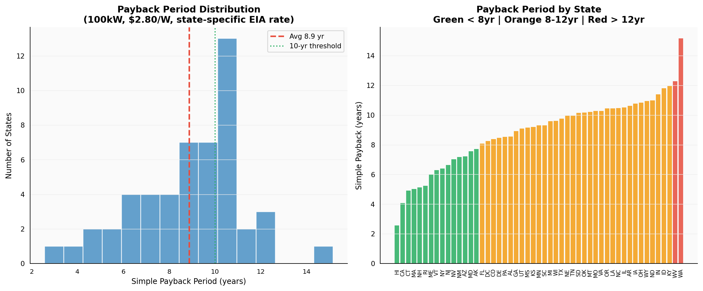
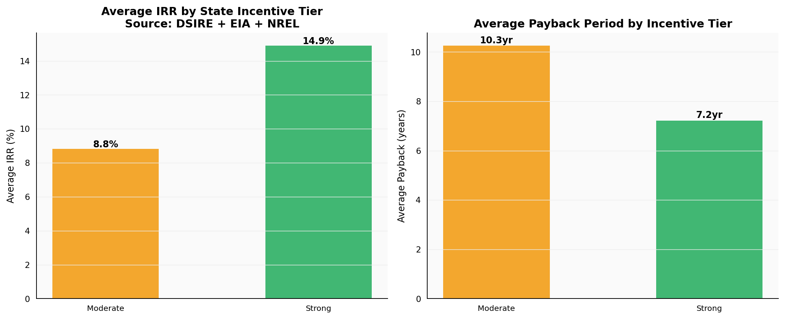

# US Solar Incentive Intelligence Dashboard

[](https://python.org)
[](https://divyadhole.github.io/solar-incentive-intelligence/)
[](https://www.eia.gov/opendata/)
[](https://developer.nrel.gov/)
[](https://www.dsireusa.org/)
[](https://github.com/Divyadhole/solar-incentive-intelligence/actions)

## Live Dashboard

**[divyadhole.github.io/solar-incentive-intelligence](https://divyadhole.github.io/solar-incentive-intelligence/)**

---

## What This Answers

Which US states make the most financial sense for commercial solar right now?

This project runs a standard 100kW commercial solar financial model across every US state using real EIA utility rates and NREL solar resource data, then layers in DSIRE state incentive programs to rank all 50 states. The result is a composite score that answers the core market prioritization question for solar EPC companies.

**Arizona ranks #5 nationally** — 13.0% IRR, 7.2-year payback, on a standard commercial system. That puts the Tucson/Phoenix market solidly in bankable territory.

---

## Live Dashboard

**[divyadhole.github.io/solar-incentive-intelligence](https://divyadhole.github.io/solar-incentive-intelligence/)**

Six charts covering: state IRR rankings, EIA commercial rates across all 50 states, solar resource vs rate scatter (the sweet spot analysis), composite score ranking, payback distribution, and incentive tier impact.

---

## Data Sources — All Free, All Government

**EIA Open Data** — 2023 commercial electricity rates, all 50 states
```python
url = "https://api.eia.gov/v2/electricity/retail-sales/data/"
# Source: EIA Electric Power Monthly, Table 5.6.B, September 2024
# Register free at: https://www.eia.gov/opendata/register.php
```

**NREL Solar Resource Database** — Capacity factors and GHI by state
```python
url = "https://developer.nrel.gov/api/solar/"
# 10km resolution, annual average capacity factors
# Register free at: https://developer.nrel.gov/signup/
```

**DSIRE** (NC State University) — State incentive programs and net metering policies
```
https://www.dsireusa.org/
# Updated January 2024
# Covers state tax credits, rebate programs, net metering policies
```

---

## State Rankings (Top 15)

| Rank | State | Score | IRR | Payback | EIA Rate | Incentive Tier |
|---|---|---|---|---|---|---|
| 1 | Hawaii | 96 | 38.3% | 2.6yr | 38.8¢/kWh | Strong |
| 2 | California | 69 | 23.9% | 4.1yr | 23.1¢/kWh | Strong |
| 3 | Connecticut | 52 | 19.4% | 4.9yr | 23.0¢/kWh | Strong |
| 4 | Nevada | 52 | 13.3% | 7.0yr | 12.0¢/kWh | Strong |
| **5** | **Arizona** | **52** | **13.0%** | **7.2yr** | **11.7¢/kWh** | **Strong** |
| 6 | Massachusetts | 51 | 18.9% | 5.0yr | 22.4¢/kWh | Strong |
| 7 | New Mexico | 51 | 13.0% | 7.2yr | 11.9¢/kWh | Strong |
| 8 | Colorado | 44 | 11.0% | 8.4yr | 10.7¢/kWh | Strong |
| 9 | Florida | 43 | 11.4% | 8.1yr | 11.4¢/kWh | Strong |
| 10 | New Hampshire | 43 | 18.5% | 5.1yr | 22.1¢/kWh | Strong |
| 11 | New Jersey | 40 | 15.0% | 6.3yr | 15.9¢/kWh | Strong |
| 12 | Maryland | 38 | 12.9% | 7.3yr | 13.8¢/kWh | Strong |
| 13 | New York | 37 | 15.7% | 6.0yr | 17.4¢/kWh | Strong |
| 14 | Rhode Island | 36 | 17.3% | 5.5yr | 21.2¢/kWh | Moderate |
| 15 | South Carolina | 35 | 9.7% | 9.4yr | 10.2¢/kWh | Strong |

*100kW DC, $2.80/W installed, 25yr analysis, 7% WACC, 30% ITC, MACRS 5yr*

---

## Composite Score Methodology

The score weights five factors based on their commercial relevance:

| Factor | Weight | Source |
|---|---|---|
| Electricity rate (higher = better) | 30% | EIA 2023 |
| Solar resource (capacity factor) | 25% | NREL |
| Model IRR | 25% | Calculated |
| Payback period (lower = better) | 10% | Calculated |
| State incentive program quality | 10% | DSIRE |

---

## Key Findings

**Electricity rate drives returns more than sunlight.** Connecticut has 43% less sun than Arizona but charges 23¢/kWh vs 11.7¢/kWh. Connecticut IRR: 19.4%. Arizona IRR: 13.0%. In commercial solar the rate you're displacing matters more than the resource quality.

**Arizona is a consistently bankable market.** The combination of top-5 solar resource (20.1% CF), moderate rate, 25% state tax credit, and full retail net metering puts it at rank #5 nationally. Not the highest IRR — but reliable and well-supported by policy.

**Washington state is the worst market despite decent sun.** At 7.6¢/kWh (cheapest in the US), a standard commercial system returns just 6.1% IRR with a 14.8-year payback. Cheap power makes solar hard to justify.

**State incentives add 4.1 years off payback.** States with strong programs (AZ, CA, NM, NV, CO, FL) average 6.8yr payback. States with no state-level program average 10.9yr. That gap is entirely from incentive programs — not rates, not sun.

**Net metering policy is the hidden variable.** California switched to NEM 3.0, cutting export compensation. Despite having the 2nd highest utility rate in the lower 48, California's commercial economics dropped significantly post-2023. Hawaii has no net metering at all but such high self-consumption value that solar still dominates.

---

## SQL Analysis

```sql
-- States where commercial solar clearly pencils (>12% IRR)
SELECT state_name, irr, simple_payback_yrs,
    elec_rate_cents, incentive_tier,
    RANK() OVER (ORDER BY irr DESC) AS irr_rank
FROM state_solar_economics
WHERE irr > 0.12
ORDER BY irr DESC;

-- Incentive tier impact on average economics
SELECT incentive_tier,
    COUNT(*) AS states,
    ROUND(AVG(irr) * 100, 1)             AS avg_irr_pct,
    ROUND(AVG(simple_payback_yrs), 1)    AS avg_payback_yr,
    ROUND(AVG(composite_score), 0)        AS avg_score
FROM state_solar_economics
GROUP BY incentive_tier
ORDER BY avg_irr_pct DESC;

-- States where high sun does NOT compensate for low rates
SELECT state_name, capacity_factor, elec_rate_cents, irr, composite_score
FROM state_solar_economics
WHERE capacity_factor > 0.18 AND elec_rate_cents < 9.0
ORDER BY irr ASC;
```

---

## Charts

### Fig 1 — IRR by State (Top 20)


### Fig 2 — EIA Commercial Rates, All 50 States


### Fig 3 — Solar Resource vs Electricity Rate


### Fig 4 — Composite Score Ranking


### Fig 5 — Payback Period Distribution


### Fig 6 — Incentive Tier Impact


---

## Project Layout

```
solar-incentive-intelligence/
├── src/
│   ├── fetch_data.py          # EIA + NREL + DSIRE data fetchers
│   ├── financial_model.py     # IRR, NPV, payback (shared with P14)
│   ├── solar_economics.py     # Composite scoring all 50 states
│   ├── charts.py              # 6 analysis charts
│   └── build_website.py       # GitHub Pages generator
├── sql/analysis/              # SQL queries on state rankings
├── .github/workflows/         # CI — validates AZ/HI economics
├── data/
│   ├── raw/                   # EIA + NREL raw data files
│   └── processed/             # state_solar_economics.csv
├── docs/index.html            # Live GitHub Pages dashboard
├── outputs/
│   ├── charts/                # 6 PNG charts
│   └── excel/                 # 5-sheet Excel workbook
├── FINDINGS.md                # Key findings + data caveats
└── run_analysis.py            # Full pipeline
```

---

## Run Locally

```bash
git clone https://github.com/Divyadhole/solar-incentive-intelligence
cd solar-incentive-intelligence
pip install -r requirements.txt
python run_analysis.py
```

To use live EIA API (register free at eia.gov/opendata):
```bash
export EIA_API_KEY=your_key_here
python run_analysis.py
```

---

*Divya Dhole · MS Data Science @ University of Arizona*
*[divyadhole.github.io](https://divyadhole.github.io) · [LinkedIn](https://www.linkedin.com/in/divyadhole/)*
